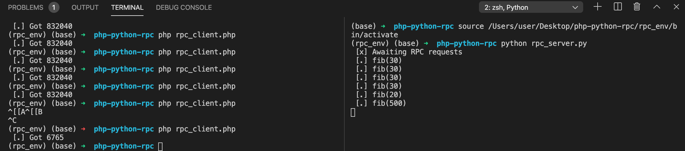

# php-python-rpc
Small POC of Remote Procedure Call from PHP Client to Python Server

### Context
We want to execute a function from PHP Client to Python Server. For this we use RabbitMQ as queue for executing remote procedure calls.

The RPC Client will send a request to the Queue. The Rpc Server will be waiting for any requests from the Client.
As soon as a request is made from client, RabbitMQ will pass the request to the server and it will be executed remotely on the server.



### How to

To install and run RabbitMQ server give the following command:

```docker-compose up -d```

To install pika for python give the following command:

```pip install -r requirements.txt```

To run the rpc client in cli simply run

```php rpc_client.php```

To run the rpc server in cli simply run

``` python rpc_server.py```

### Conclusion
Remote Procedure Calls are criticized in the industry due to its slow nature and it could be confusing if some functions are executed
remotely and some are executed localled. For a smooth RPC follow these guidelines.

1. Have a good documentation for your project, specify which calls are remote and which calls are local.
2. Define clearly, what the app should do, in case rpc server goes down for long time.
